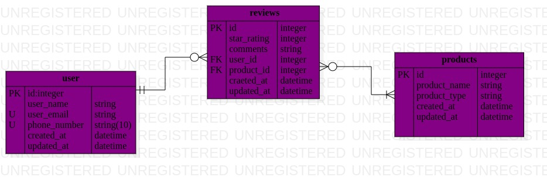

# phase3w2-Product-Review-challenge

## Project title

    Product Reviews System

# Getting started

- In order for you to use the content in this repo ensure you have the following:
  - Linux
  - Mac Os
- To use this repo on your machine you need to clone by either using:
  - terminal
  - forking directly from the repo.

#### Cloning using button labelled forking

click on the the fork button in the top most rigt corner of the github to fork the repo to your own account

## Running and testing

Running the application is very straight forward. You can use the following steps to run the app.

This application is interactive on the terminal.

Run the command below to install ruby gems;

              bundle  install 
Then run the command below to migrate the tables;

               rake db:migrate

Then run the command below to add data into your database

       bundle exec rake db:seed:replant

  Then run the command below to start your files     
           ruby bin/run

 To view the outputs for each deloverable per instance comment out the commented code in this path bin/run    

      To view results for all methods that are in each class , comment out from line 5 to line 10

      Then for Products  comments out from line 13 to line 18

      And for Users comments out from line 20 to line 25

# Entity Relationship Diagram
- In  Product has many Users, a User has many Products, and a Review belongs to a User and to a Product. Product-User is a many-to-many relationship. Below is how i realeted using ERM Diagram

## Description
- E-Commerce Product Reviews System
.This is a Ruby on Rails project that simulates a system for product reviews in an e-commerce domain. The project has three main models: User, Review, and Product.

- For the purpose of this project, a Product has many Users, a   User has many Products, and a Review belongs to a User and to a Product. Product-User is a many-to-many relationship.

## Author

[Moses Ochacha]https://github.com/Mosesochacha/phase3w2-Product-Review-challenge

## License
 
[Apache License 2.0](https://choosealicense.com/licenses/)

## Tech Stack

       Ruby
